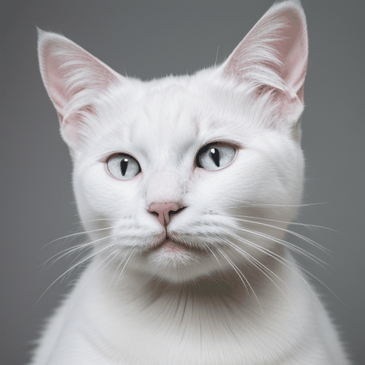
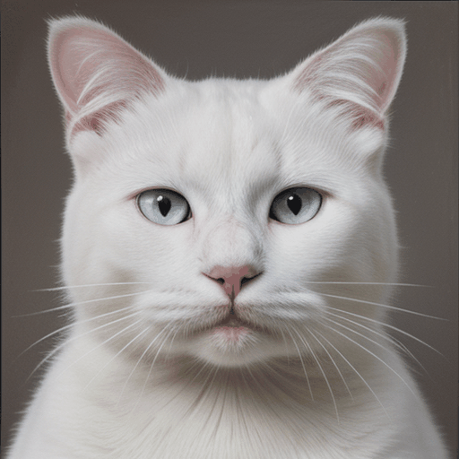

# Animated image morphing

Morphing animation based on a smooth transition of the starting portrait to the final.
It uses the face_alignment library for facial recognition and the gradio for the user interface.

Examples
-------------

